# Hostfilly React technical test

### How to Run
```md
npm install
npm run dev

# open http://localhost:5173/ in a browser

npx cypress install
npx cypress open
```
The repository contains devcontainer for vscode. **Cypress doesn't work inside the container.** You have to run them outside of the container

I used Zustand as a storage. You can use Redux Google Chrome extension to see the storage values.

### Task description
The task doesn't have details at all. Please have a look at the context below for understanding my implementation.


There is a company that owns several real estate properties **in different time zones**. The company books these properties by receiving phone calls from clients or messages in a messenger. A manager handles the booking. In order to book the property, the manager clicks on a property and **sees the page I've created**.
Each property has a time zone. I save a timestamp in a store and display the date and time in the property’s time zone. You can change start and end booking time using `checkIn` and `checkOut` constants in `constants/property.ts` file.

### Other
- I didn't implement component tests. The task is big for a test task and I don't have enough time.
- I left the option to select dates in the calendar that are less than the current date to make testing easier

### Screenshots
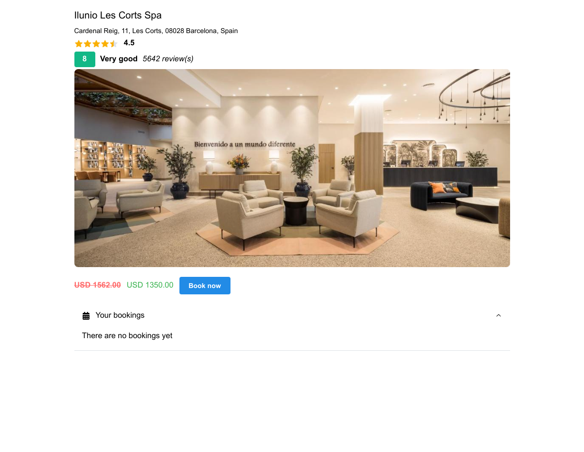
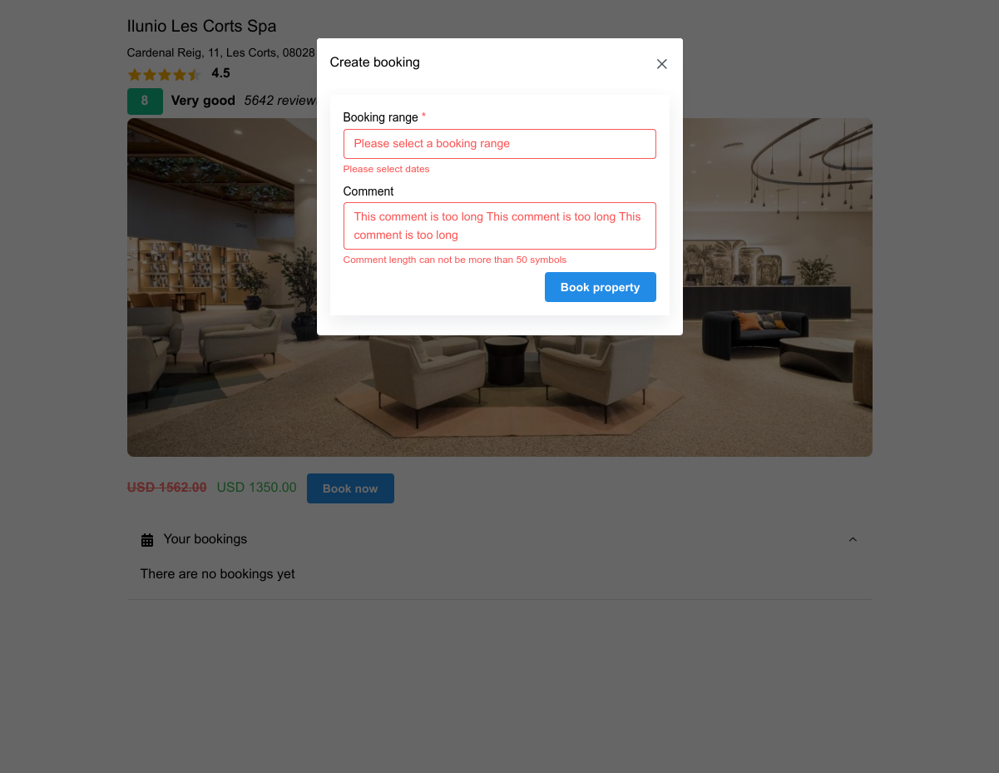
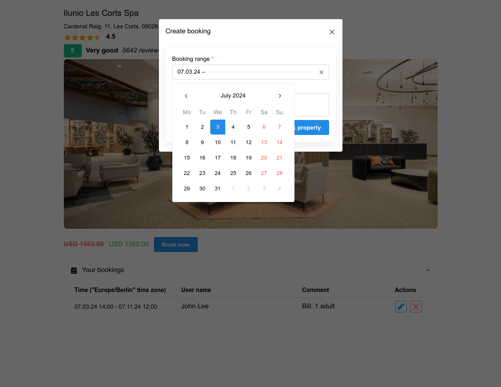
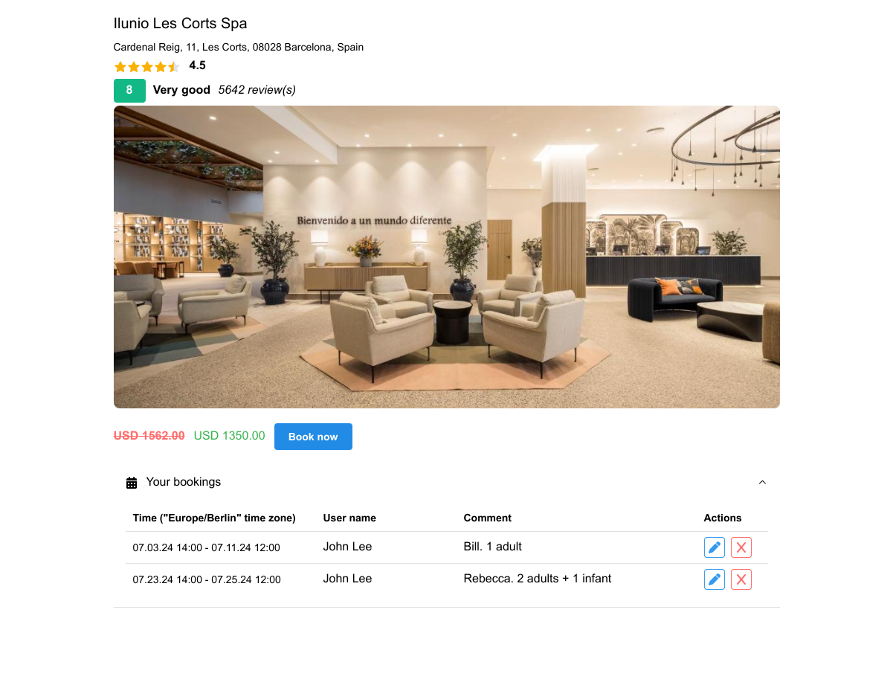
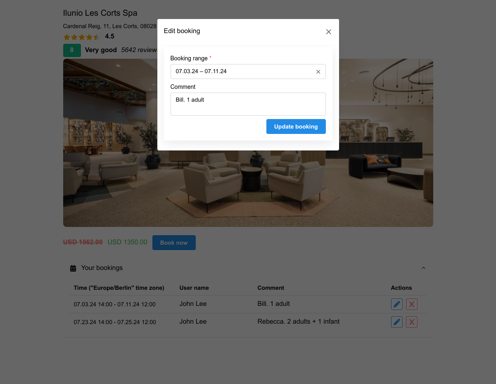
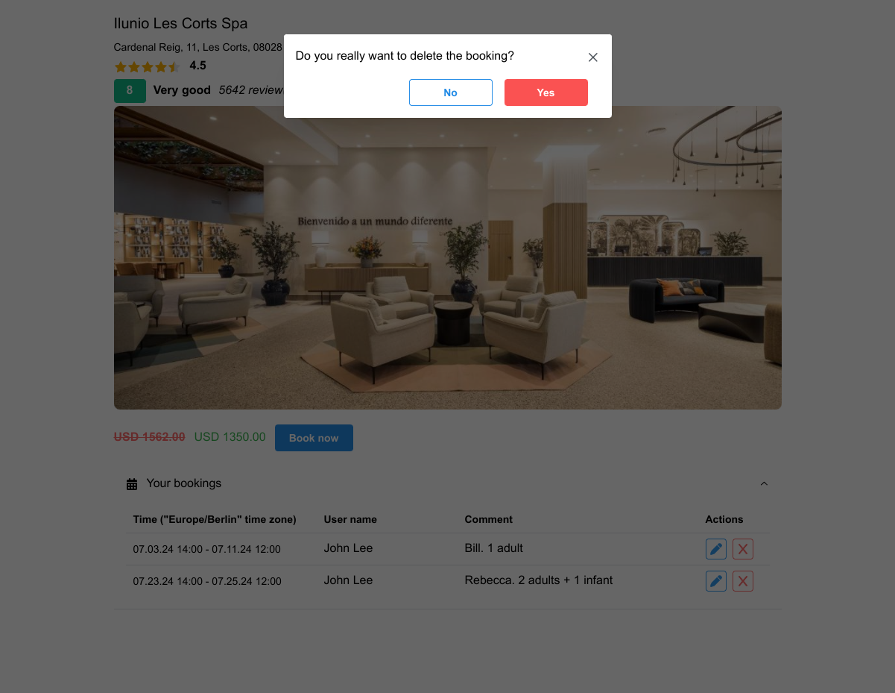
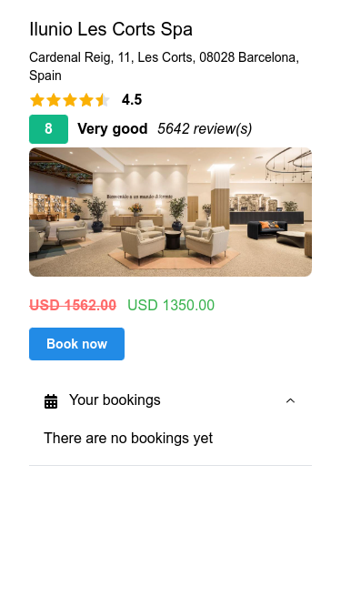
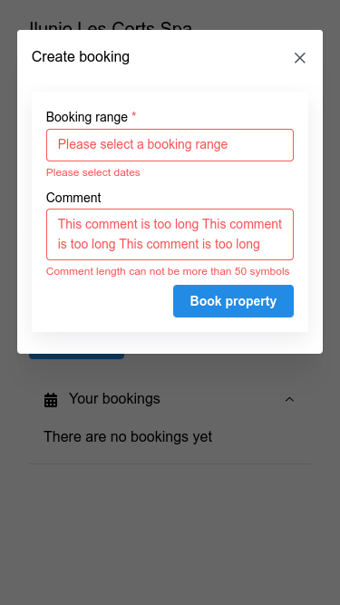
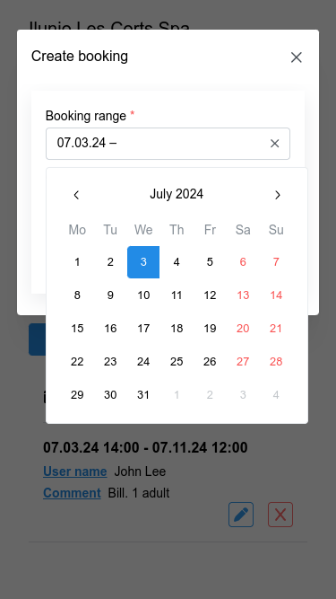
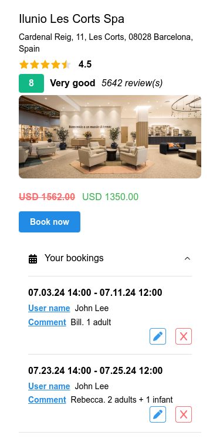
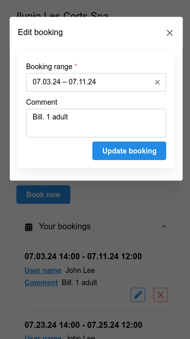
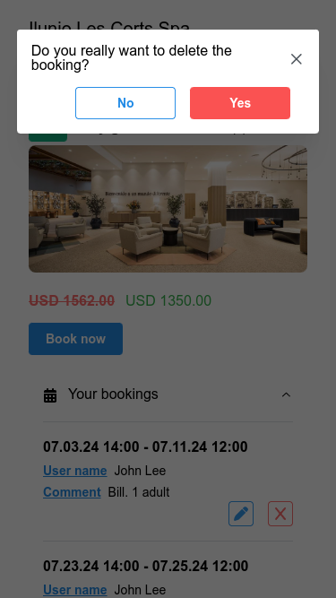